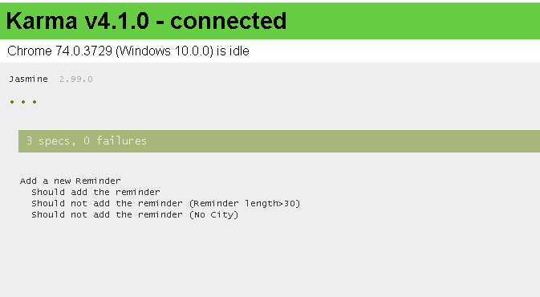
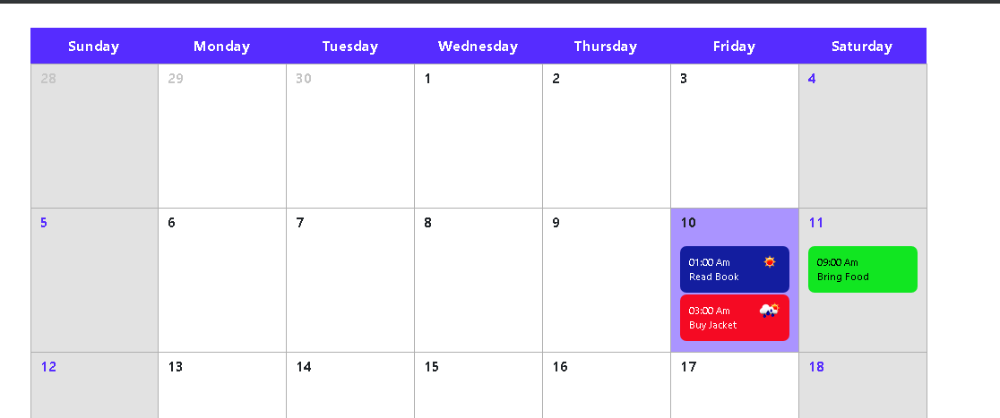
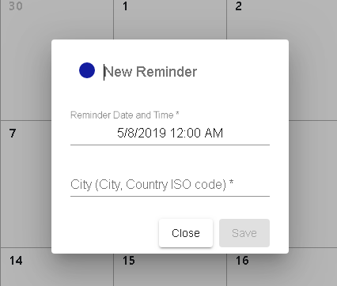
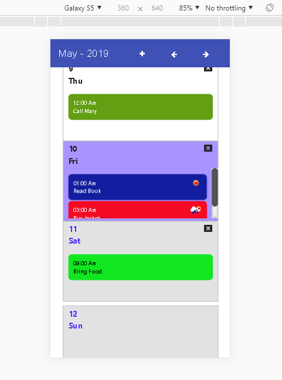

# Demo Calendar

Go to  [https://github.com/andmaltes](https://github.com/andmaltes) to check the calendar demo.

## Features

Ability to add a new "reminder" (max 30 chars) for a user entered day and time. Also, include a city.

Display reminders on the calendar view in the correct time order.

Allow the user to select color when creating a reminder and display it appropriately.

Ability to edit reminders – including changing text, city, day, time and color.

Add a weather service call from a free API such as Open Weather Map, and get the weather forecast (ex. Rain) for the date of the calendar reminder based on the city.

Unit test the functionality: Ability to add a new "reminder" (max 30 chars) for a user entered day and time. Also, include a city.

## Even More Features

Expand the calendar to support more than the current month.

Properly handle overflow when multiple reminders appear on the same date.

Functionality to delete one or ALL the reminders for a specific day.

Redux used for the structure of the calendar.

### Bonus

Drag and Drop events!

## Some Screenshots

## Constraints

For a correct weather forectast, make sure you include the city name followed by the country in ISO code. EJ, Bogota,CO Madrid,ES Lima,PE
If you need the list of names, refer to: [http://bulk.openweathermap.org/sample/](http://bulk.openweathermap.org/sample/)

Open Weather only allows the forecast of the three next days in its free version.

Internet Explorer 10+ Compatibility
